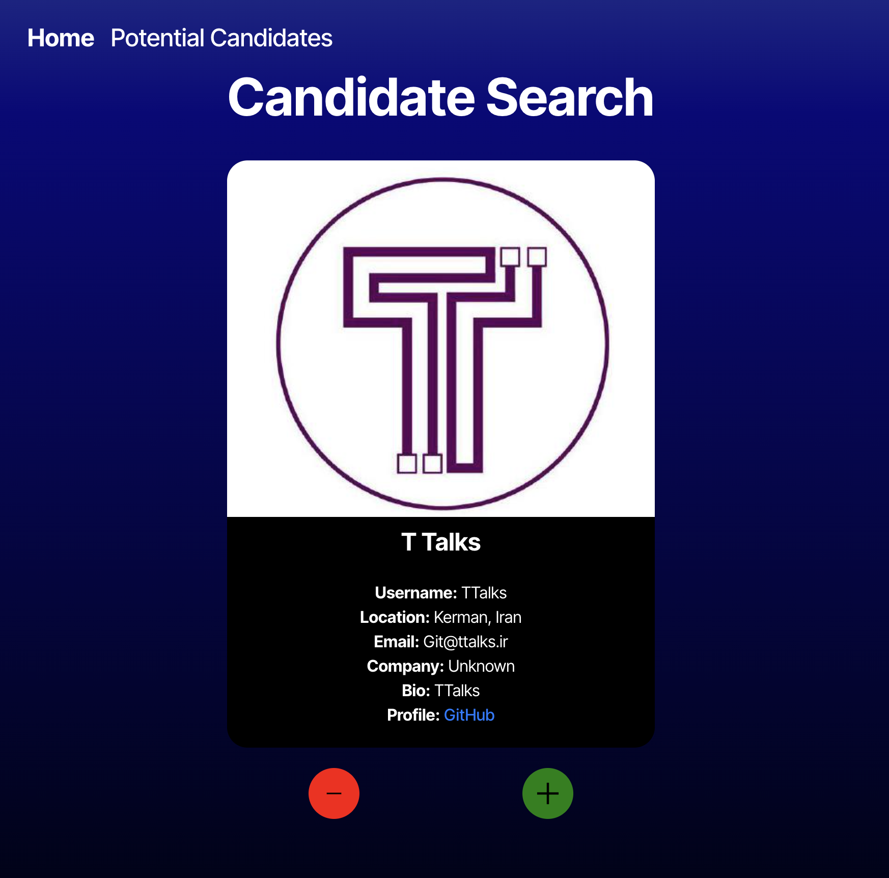
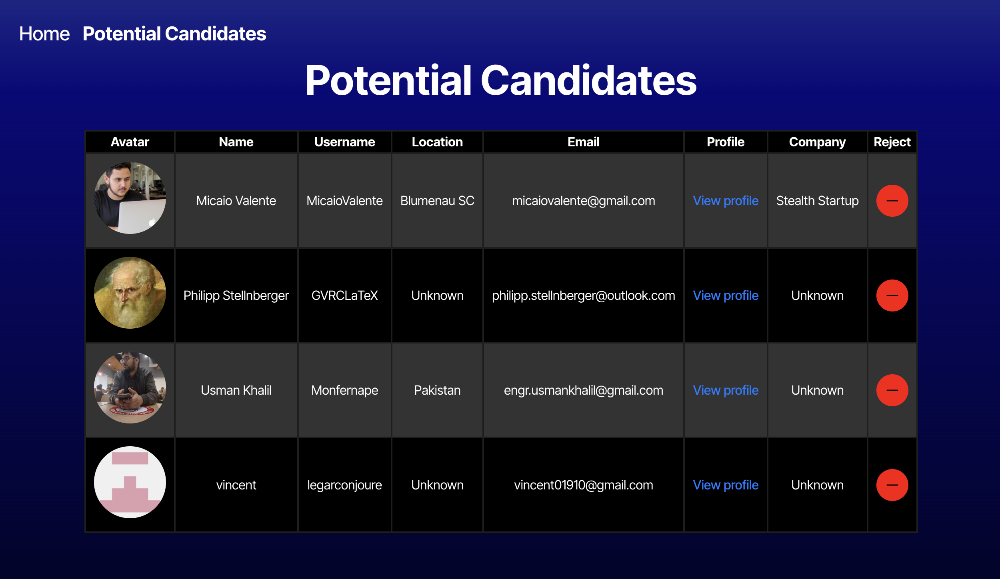
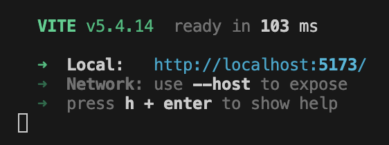

# Candidate Search - Tinder for Employers!

## Description

This project allows employers to search for potential candidates on GitHub by presenting a candidate then allowing the employer to reject or save the candidate. Candidates that are saved get moved to a "Potential Candidates" list, where the employer can then assess the candidates more closely and compare them amongst each other. The purpose of creating this application was to demonstrate my ability to connect to the GitHub API and develop a front-end application using React and TypeScript. Throughout this project, I improved my TypeScript and React skills, learned how to troubleshoot API connectivity issues, and modularized my code. While this application may not actually be useful for employers, as this does not filter for applicants who have actually applied to a postion, it does offer a fun way of scrolling through GitHub accounts.

## Table of Contents

- [Link to Application](#link-to-application)
- [Installation](#installation)
- [Usage](#usage)
- [Credits](#credits)
- [License](#license)
- [Questions](#questions)

## Link to Application

https://swipe-candidate-search.onrender.com

## Installation

This application is accessible in any web browser using the link above. No installation is required.

To install the application on your local device for editing or testing, perform the following steps. Note that you will need a [GitHub Personal Access Token](https://docs.github.com/en/authentication/keeping-your-account-and-data-secure/managing-your-personal-access-tokens#creating-a-fine-grained-personal-access-token) to increase the API rate limit. The token used for this project is not visible in the repo.

1. In the terminal, navigate to where you would like the repo to be stored on your device.

2. Clone the repo to your device using the following:

    ```sh
    git clone https://github.com/amelia1105/swipe-candidate-search.git
    ```

3. Switch into the swipe-candidate-search directory. 

    ```sh
    cd swipe-candidate-search
    ```

4. In the command line, install dependencies using the following:

    ```sh
    npm install
    ```

## Usage

The application can be used in the web browser. Use the link above to access the application.

1. The link will take you to the website shown in the screenshot below.

    

2. If you like a candidate and want to save them to your Potential Candidates table, hit the green plus sign. If you don't like a candidate, hit the red minus sign. Either way, you will be presented with the next candidate.

3. To view your saved candidates, navigate to the Potential Candidates page at the top. You will then be presented with a table of saved candidates.

    


To view the application on your local server, perform the following steps. You must have a [GitHub Personal Access Token](https://docs.github.com/en/authentication/keeping-your-account-and-data-secure/managing-your-personal-access-tokens#creating-a-fine-grained-personal-access-token).

1. After the installation steps have been completed and you have your API key, navigate to the .env.EXAMPLE file. Paste your API key where it says "ACCESS_TOKEN_HERE", and change the file name to ".env" instead of ".env.EXAMPLE".

2. Build and start the server using the following command. Be sure that you are in the swipe-candidate-search directory.

    ```sh
    npm run dev
    ```

2. You should see that the server is running on port 5173. Follow the link to see the application in a browser.

    

## Credits

Starter code was sourced from Rutgers University Coding Bootcamping section RUT-VIRT-FSF-PT-10-2024-U-LOLC-MWTH > Assignments > Module 13 Challenge > [starter code](https://bootcampspot.instructure.com/courses/6369/assignments/90354?module_item_id=1341351). The starter code includes all folders and files except for the CandidateCard.tsx, SavedCandidateList.tsx, Nav.css, CandidateCard.css, SavedCandidateList.tsx, and the assets folder and files. However, many of the starter code files only contained templates without usable code, like the Nav.tsx, Candidate.interface.tsx, CandidateSearch.tsx, and SavedCandidates.tsx. I added code to all of these files. Some changes were made to the App.tsx file when troubleshooting API issues, and additional packages were installed that were not originally in the package.json. Additionally, I used GitHub Copilot and ChatGPT for assistance in coding.

## License

MIT License

Copyright (c) 2025 Amelia Alvarado

Permission is hereby granted, free of charge, to any person obtaining a copy
of this software and associated documentation files (the "Software"), to deal
in the Software without restriction, including without limitation the rights
to use, copy, modify, merge, publish, distribute, sublicense, and/or sell
copies of the Software, and to permit persons to whom the Software is
furnished to do so, subject to the following conditions:

The above copyright notice and this permission notice shall be included in all
copies or substantial portions of the Software.

THE SOFTWARE IS PROVIDED "AS IS", WITHOUT WARRANTY OF ANY KIND, EXPRESS OR
IMPLIED, INCLUDING BUT NOT LIMITED TO THE WARRANTIES OF MERCHANTABILITY,
FITNESS FOR A PARTICULAR PURPOSE AND NONINFRINGEMENT. IN NO EVENT SHALL THE
AUTHORS OR COPYRIGHT HOLDERS BE LIABLE FOR ANY CLAIM, DAMAGES OR OTHER
LIABILITY, WHETHER IN AN ACTION OF CONTRACT, TORT OR OTHERWISE, ARISING FROM,
OUT OF OR IN CONNECTION WITH THE SOFTWARE OR THE USE OR OTHER DEALINGS IN THE
SOFTWARE.

## Questions

For any questions about this project, please contact me by email: aebellanger@yahoo.com